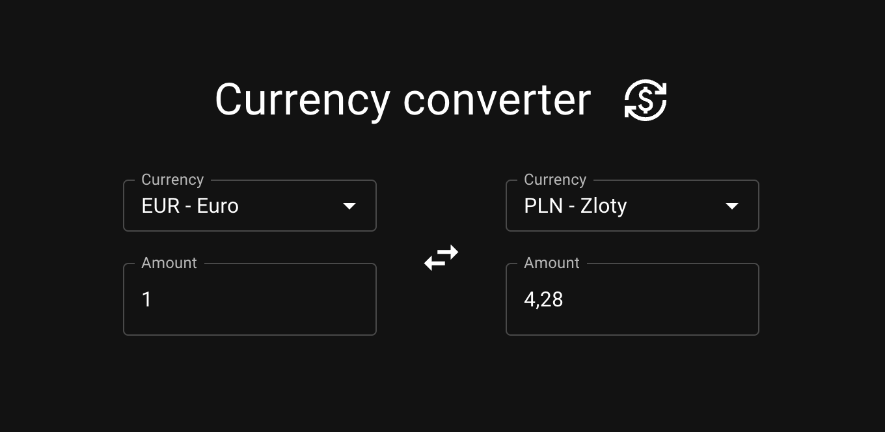

# Currency converter



## Getting Started

### System Requirements (Next.js):

Node.js 18.17 or later.
macOS, Windows (including WSL), and Linux are supported.

### Installation

Run `npm install`

### Configuration

Create .env.local file in the root directory to store your configuration variables.
.env file contains a template for all supported env variables.

If you want to use the CurrencyBeacon with this project add the following to the .env.local file:

```
CURRENCY_BEACON_API_KEY=<YOUR_API_TOKEN>
CURRENCY_SERVICE=beacon
```

If you want to use a mock server then add the following to the .env.local file. It makes it easier to develop as you can simulate delays and failures with it. You also won't use your CurrencyBeacon quota.

```
CURRENCY_SERVICE=development
```

### Development server

Run `npm run dev` to start the development server.

You can also try `npm run dev:https` if you want to serve the app on your local network and access it from mobile devices. On the first run it will configure certificates with mkcert so that it can serve the app over https.

Open http://localhost:3000 or https://localhost:3000

## Features

- ✅ Bidirectional FIAT currencies conversion
- ✅ Localized currency formatting
- ✅ Optimized for mobile devices
- ✅ Auto light/dark theme
- ✅ Server side currencies data fetching
- ✅ Proxy endpoint for currency conversion
- ✅ [Postman collection for third party API testing](currencybeacon.postman_collection.json)
- ❌ Bidirectional FIAT and Crypto currencies conversion (third party API issues)
- ❌ Tests (The app is currently in the prototype stage)

## Project structure

- `src/types` - Core application types. Exports the `Currency` type which is used both on the client and the server side.
- `src/components` - Client side components. Currency converter form implementation is located in this module. There are the following components:
  - `amount-input` - enables users to type in the currency amount. Formats values according to the current browser language. Handles display of the numeric keyboard on mobile devices.
  - `currency-select` - combobox that enables users to search for and select a currency
  - `converter-form` - Pure form component that allows to select the source and the target currencies and amounts for conversion.
  - `converter` - Adds logic layer on top of the `converter-form` the handle updates and api calls.
- `src/app/page` - The server side entry point. Responsible for pulling the list of currencies from the service on the server side and rendering of the `converter` component.
- `src/api/convert/route` - Custom convert endpoint implementation. It forwards requests to a service so that api keys won't leak by calling the service endpoint directly from the client side.
- `src/services` - Implements development and production currency services. Service may be configured using env variables. (build time)
- Feel free to explore other modules if you want to learn more.

## Decision log

- [Language] [TypeScript](https://www.typescriptlang.org) - static typing enables early bug detection and better development experience with tools like autocompletion
- [Framework] [React](https://react.dev) - declarative Web UI development, popular, usage experience, ecosystem
- [Framework] [Next.js](https://nextjs.org/docs) - easy to build fullstack js apps, popular, built in TypeScript support, built in deployment configuration, built in bundling of popular file extensions
- [Library] [Material UI](https://mui.com/material-ui/getting-started/) - popular, usage experience, well designed, follows accessibility guidelines, css-less development
- [Library] [react-number-format](https://s-yadav.github.io/react-number-format/docs/intro) - suggested by Material UI. Testing shown that it provides all required features and is easy to use.
- [Library] [Immer](https://immerjs.github.io/immer/) - Makes it easier and more readable to update immutable objects. Stronly linked to the React and Redux ecosystem
- [Architecture] Shared core `Currency` type to aid both server and client side development
- [Architecture] Server side implementation lcoated in the `src/app` directory according to Next.js guides.
- [Architecture] Client side implementation located in the `src/components` directory to improve server/client separation visibility.
- [Architecture] Prefer pure React components and composition with logic on the parent level components to improve readability, understanding and testability (coming next).
- [Architecture] Forwarding requests to third party services via custom server side services to prevent sensitive data leakage and gain better control over the entire system.
- [Architecture] Request tracking to avoid race conditions inside of the `Converter` component
- [Architecture] Request debouncing to avoid unnecessary request while a user is till typing inside of the `Converter` component

## Third party

I created a Postman collection that helped me to learn the CurrencyBeacon API.
